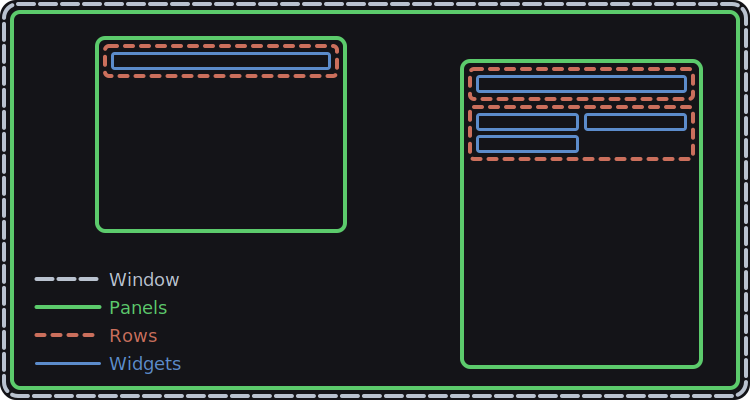
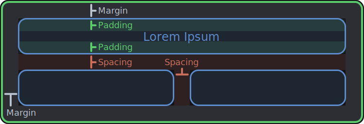

# Layout
The layout engine is built around two key concepts: panels and rows. Panels are rectangular regions within a window. Rows are placed within panels. The layout engine places widgets inside rows inside panels.



## Panels
A panel is a 2D rectangle in a window. You can create a panel at any time by calling `iui.layout.beginPanel(x, y, w, h, margin?)`. If you begin a panel, you must end it later by calling `iui.layout.endPanel(advance?)`. When you begin a panel, it becomes the current panel, and when you end it, the previous panel becomes the current panel again. The current panel is used to lay out rows.

It's common to create child panels within a panel. For example, the split view widget fills the current panel, and creates two sub-panels: one for each side of the split. You may then place widgets within the sub-panels, or even create further panels inside.

Even though there's a conceptual parent-child hierarchy, panels may be placed anywhere in a window, even outside their parent panel. Typically, though, you'll want to base a panel's frame on its parent's. You can get the bounds of the current panel by calling `iui.layout.getPanelBounds(index?)`, which returns the `x`, `y`, `w`, and `h` of a panel. You may then use those values as a basis for the new bounds you pass to `beginPanel`.

## Rows
The layout engine uses rows in panels to size and position widgets. Rows can have multiple columns. When you add a widget, the layout engine places it in the current column of the current row of the current panel. It then advances to the next column for the next widget. If you place widgets in every column of a row, the layout engine then wraps around to the next row.

You configure the row layout by calling `iui.layout.beginRow(columns, rowHeight?)`. You can pass a custom value for `rowHeight`, or let the layout engine set a default by omitting the argument.

```lua
-- The layout engine will lay out widgets in rows having two dynamic-width
-- columns. Since we're not passing a `rowHeight`, the layout engine will
-- determine one for us.
iui.layout.beginRow({ kind = "dynamic", count = 2 })

-- Now, we add three widgets. The first two widgets will go in the first row, 
-- and the third in a second row.
iui.label("Label 1")
iui.label("Label 2")
iui.label("Label 3")
```

The power of the row system comes from the `columns` argument. You can configure the columns to be in one of several modes: fixed width, dynamic width, mixed width, and intrinsic width.

### Fixed Width Columns
```lua
{
	kind: "fixed",
	size: number
}
```

When using fixed width columns, columns will be `size` points wide, and the layout engine will fit as many columns as possible within the current panel's available width.

### Dynamic Width Columns
```lua
{
	kind: "dynamic",
	count: number
}
```

With dynamic width columns, the layout engine will place `count` columns within the width of the current panel, with their size set proportionally.

When you begin a new panel, if you don't configure the row yourself, the layout engine automatically configures the row to be dynamic width with a count of 1. So the default is one widget per row, with each widget filling the entire width of the panel.

### Mixed Width Columns
```lua
{
	kind: "mixed",
	columns: {
		kind: "fixed" | "dynamic",
		size: number
	}[]
}
```

Mixed width columns allow you to have both fixed and dynamic columns in a row.

To calculate the size of mixed width columns:
1) Initially, the full width of the panel is available.
2) Fixed columns are given their requested `size`, which is also subtracted from the available width.
3) The remaining width is distributed to the dynamic columns, proportionally weighted by their `size`.

If you had two dynamic columns in a mixed width row, one with a `size` of `2.0`, and the other with a `size` of `1.0`, the first would receive two-thirds of the available space, while the second would receive one-third.

### Intrinsic Width Columns
```lua
{
	kind: "intrinsic",
	default?: number,
	limit?: number
}
```

Intrinsic width columns are an advanced feature with capabilities unavailable to other modes, but limitations to be aware of. They allow widgets to suggest their desired, natural width, and try to set the column width to that intrinsic size.

If a widget produces an intrinsic width, that will be used as the column width. If not, a default width will be used. If you pass a `default` width in `iui.layout.beginRow`, that width will be used as a fallback. If you don't pass `default`, then the default will be however much space is still available in the row.

By default, intrinsic width columns will place as many columns in a row as will fit. If a widget is too wide to fit in the current row, it'll be placed on the next row. You can pass a `limit` to cap the number of widgets that may be placed in a row.

> [!IMPORTANT]
> Intrinsic width columns measure their aggregate content size as they go, but this size isn't available until after layout has been performed once. This creates a problem if you need that size *before* placing widgets, such as to size their containing panel. It's up to you to decide how to handle this. Built-in widgets that use intrinsic width columns, like submenu panels, don't draw anything on the first frame, instead using that frame only to calculate the size of the panel.
## Margin, Spacing, Padding
In [`iui.style`](./style_stack.md), three properties guide the layout engine, `margin`, `spacing`, and `padding`.



The `margin` insets rows within a panel, creating a gap between the edges of rows and their panels.

The layout engine uses `spacing` to add gaps between widgets in rows. The `spacing` also applies to the vertical space between rows.

Finally, widgets use `padding` to try, room permitting, to inset their content within their boundaries. Additionally, `padding` is used when calculating the default row height, if you don't pass a manual height when creating a row. The default height of a row is `fontHeight + padding * 2`.